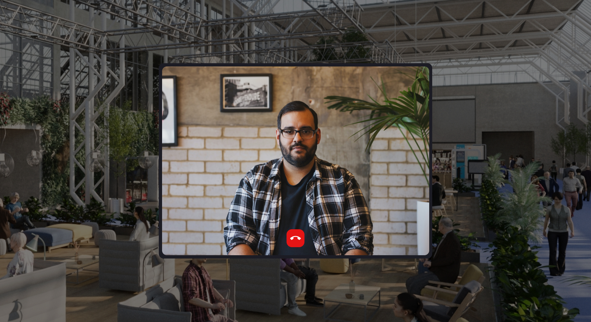

# Video Call -Prototype
Video is easy, but also easy to get wrong, especially at scale.  

Showcasing a stable video call between one or more clients in the same room. Using sockets, peer server and WebRTC to make the connections and stream data. Stable on dekstop and could be expanded to modern mobile devices. For production the solution should be integrated with a 3rd party service provider like Twilio, Zoom, Whereby or simliar who provides the backend infrastructure that automatically scales to demand.

[Checkout the source: ViewVideoChat.js](src/views/videoChat/index.js)  

[Live Demo](https://vvcp.herokuapp.com/) (give it 45 seconds to spin up as its a free/demo server)
